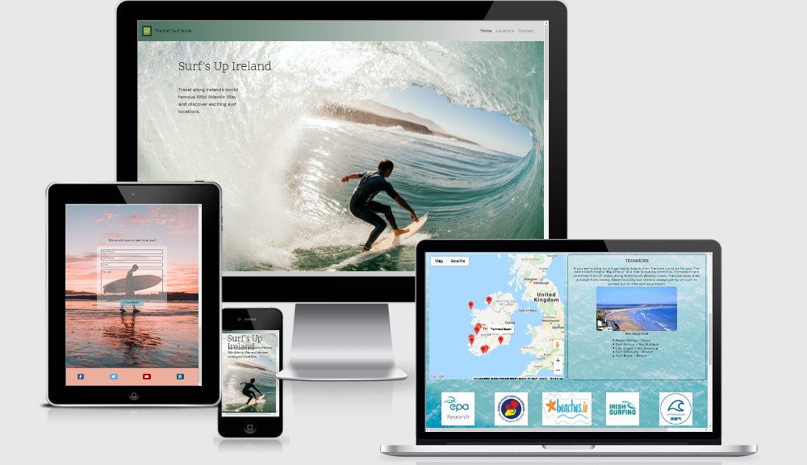
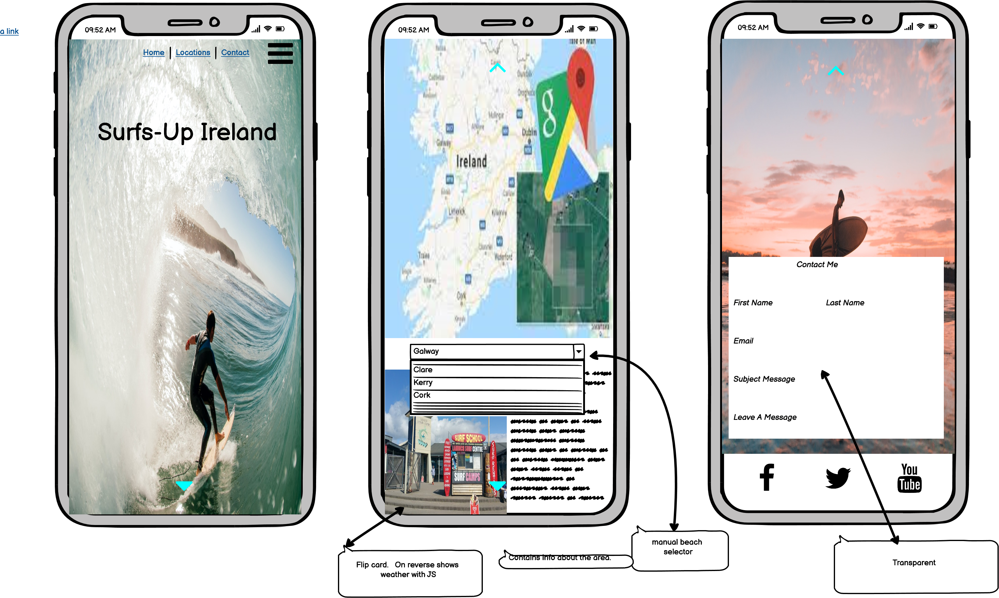

# Surfs Up Ireland

### [Link to Live Github hosted website](https://vincenolan999.github.io/ms2-surfs-up-ireland/)

## <u>Screenshots</u>

 

## A User-Centric Frontend Milestone Project

- This is my Second Milestone Project with Code Institute which introduces interactivity into the website by using Javascript.
The project I choose was an Interactive website of Surf locations along the Irish coast which has selectable locations from Google maps.
Also included in the site, a fully functioning Contact section for a user to send a comment/message. 

---
## <u>Table of Contents</u>
- [Screenshots](#screenshots)
- [UX](#ux)
    - [User goals](#user-goals)
    - [User stories](#user-stories)
    - [Structure of the website](#structure-of-the-website)
    - [Wireframes](#wireframes)
- [Features](#features)
- [Technology Used](#technology-used)
- [Testing](#testing)
    - [Functionality testing](#functionality-testing)
    - [Compatibility testing](#compatibility-testing)
    - [Code Validation](#code-validation)
    - [User stories testing](#user-stories-testing)
    - [Issues found during site development](#issues-found-during-site-development)
    - [Performance testing](#performance-testing)
- [Deployment](#deployment)
- [Credits](#credits)
 
 ---
## <u>UX</u>

 ### User Goals
  
 #### New user Goals

- Be able to find out more about Nicola

- Be able to see pictures of Nicola.

- Be able to contact Nicola.

- Fans, Employers, or artists to be able to contact Nicola to hire or collaborate.

- Be able to see where Nicola is next performing.

#### Returning User Goals

- I want to keep up-to date on where Nicola is performing.

### User Stories

#### As A New user.

- I want to find out how Nicola became a singer.

- I want know where and when Nicola is next performing
 
- I want to be able to contact Nicola as I want to hire her to sing at my event.

- I want to contact Nicola as I am an artist and would like to collaborate with Nicola

#### As A returning user.

-  I want to see pictures of Nicola.

-  I want to keep up-to date where Nicola is next performing.

#### WebSite Owner story

- I want to have a Web presence so prospective fans/employers/artists can find out more about me.

- Be able to update and inform my fans of my singing and songwriting and any new videos or music I am producing.

- A way for fans/employers/artists to contact me e.g hiring me.

### Structure of the website

- I want the website to be easily accessible, simple to navigate and user friendly. It must also be displayed 
  for various devices (desktop ,Tablet, Mobile Phone) whilst maintaining a great user experience . Links within the website directing me to other Pages either within
  this website or to other social media accounts (youtube etc). 

### Wireframes

- I used Balsamic to create wireframe mwock ups of ho I envisioned the website to look.
These are listed below.

-  

---
## <u>Features</u>

- This website will consist of 1 main page of three sections. The sections will be a landing section with full page hero image of a surfer, the next section is the main content which features google maps that has selectable markers that then displays location images and information.  Finally the last section is a fully functioning contact section hosted by emailjs. 

#### Fonts

- The main font used is 'DM sans' with back-up of  sans-serif  obtained from [Google-fonts](www.fonts.google.com)

#### Images

- The main background images have all been obtained from [unsplash](www.unsplash.com) used for images as well. see [#credits](#credits)

- The images of the locations were obtained by google search and from Pinterest.  There were no obvious copyright restrictions.

#### Navbar and footer

- low profile navigation bar and footer with a color sceme that reflects the website.

- Navbar located at top with 'Brand' to the left and a responsive menu on the right. For Mobile and tablet this is 
  an expanding 'Hamburger' menu opening below the icon to reveal the three pages (Home, locations and Contact).

- Footer is located at the bottom and contains Social media links.

#### Hero Image

- High quality Image of a person surfing relavant to the website theme

#### Location and Map section

- Interactive googlemaps with custom markers. Zoom to function and scrollwheel enable for smooth transitions.   Selecting a marker on the map will change the display of the location section which has a short description of the beach, a relevant image and then useful information in regards to surfing.

#### Contact Page

-  Fully functioning contact form,  this could be for users to suggest other irish surf sites or to collaborate on other projects.

### Existing Features

- Smooth scrolling enabled from hamburger menu which makes for a cleaner visual experience. 

- Interactive map section that can change location information that is being displayed. 

- Fully functional contact section which uses focus to change background color to enable higher contrast in text input.  Contact section confirms success on sending a mail 
  and then resets the form. 

#### Future Features 

- expansion of Surfing sites in ireland.

- upto date weather and 'swell' incorporated into the location display.

- Create a brand for other countries  (eg. Surfs Up Australia etc).

- merchandise section relevant to surfing.

[Back to Table of contents](#table-of-contents)

---
## <u>Technology Used</u>

* [HTML5](https://en.wikipedia.org/wiki/HTML5)
  - Main Programming language

* [CSS](https://en.wikipedia.org/wiki/CSS) 

  - Style sheet language

* [JS](https://www.javascript.com/)

  - Used to create interactive funcionality

* [Google Fonts:](https://fonts.google.com/)

  - Used to import custom fonts

* [Font Awesome:](https://www.fontawesome.com) 

  - Used to import icons

* [GitHub:](https://www.github.com.com)

  - Used to store projects created in gitpod. 

* [Gitpod:](https://www.gitpod.io.com)

   - used to develop the project, including version control (using commits and comments.)

* [Bootstrap 4:](https://www.getbootstrap.com)

  - used to assist in a responsive site with a mobile first approach. 

* [Balsamic:](https://www.balsamiq.com)

   - Used to create wireframe of the project.

* [windows Photo editor](https://www.microsoft.com/en-us/p/photo-editor-for-windows-10/9mzwk7vt6b3g?activetab=pivot:overviewtab)

   - Basic photo editor

[Back to Table of contents](#table-of-contents)

---
## <u>Testing</u>

- Navbar
    - Clicking on the menu links takes you to the desired section.
    - navbar brank link disabled
    - hamburger menu appears at relevant view width and drop down menu works crorrectly

- Map and Location Section 

    - Googlemaps responsive, markers are shown and when pressed the information section including image is changed (all markers checked and correct)

- partner links

    - all 5 links tested and redirect to a new tab of the correct website
  
- Contact Page.
    
    - each input box hightlights light blues as intended  (helps with contrast)
    - fill in field warning for input boxes present if left blank.
    - fill in field with email address correctly displayed
    - fill in field for textarea.
    - Form completed with correct details to test reciept of message.
         - send email button wording changes to 'sending'
         - sent! alert box appears requiring a click on ok. (correct)
         - 'sending' button returns to 'send email'
         - contact from is reset.
         - Emails is recieved from Emailjs, this confirms contact form working as intended.
         
- Footer 
    - Clicking the footer icons takes you to the correct website opened in a new tab.

### Functionality testing

- chrome Browser used to run Gitpod and developer tools used to test , solve problems, style and responsiveness.
Chrome developer tools used to check compatibility during project and to check on consistency.

- Mozilla Dev tools used to test in addtion to chrome dev tools.    

- No issues detected.

### Compatibility testing

- I have tested the website on the virtual devices contained with the Dev Tools of Mozilla and Chrome with no 
issues seen on either. A wide range of screen sizes tested from mobile, tablet and desktop.

- I have tested compatibility on the github pages published website of the project on a 1920 x 1080 monitor, a galaxy s7 
and a Motorola  one+ mobile phone with no issues noted.

- The website was submitted for peer review and no Issues were recorded by thous viewing.

### Code Validation
-  https://jigsaw.w3.org/css-validator/   
    - passed with no errors found. This document validates as CSS level 3 + null !
-  https://validator.w3.org/
    - all pages checked with no issues. 
-  https://wave.webaim.org/ - A web accessibility checker
    - no errors or contrast errors detected. 
    - contrast passed . Contrast Ratio of 5.08 on about me page and 5.12 on contact page.

### User stories testing

- I want to find out how Nicola became a singer.
    - On main navigation page the about me section is present.

- I want know where and when Nicola is next performing
    - On the main page scrolling to the bottom presents the events section.

- I want to see pictures of Nicola.
    - From the navigation bar I can select the Gallery link which then displays images of Nicola
 
- I want to be able to contact Nicola as I want to hire her to sing at my event.
    - On the navigation bar there is a link for Contact. Selecting this takes me to a contact form where I can
    input my details and leave a message.

- I want to contact Nicola as I am an artist and would like to collaborate with Nicola.
    - There is a contact page where I can leave my details and message for Nicola.

### Issues found during development

- 

### Performance testing

  - I have used [Lighthouse](https://developers.google.com/web/tools/lighthouse/) for the performance testing.
The first attempt showed a few performance drops on mobile devices. These included no meta values for the social media links, a h4 header being used, no meta description and older image format used.

- These were addressed and the results as follows.

#### Desktop performance

#### Mobile Performance

- PDF of results contained within assets/docs.

[Back to Table of contents](#table-of-contents)

---
## <u>Deployment</u>
My project was developed on Gitpod with regular commits during development to Github via pushing. This also ensured against data loss.

To deploy my project in github I took the following steps.

- Login and Select the repository in github. ([ms2-surfs-up-ireland](https://github.com/VinceNolan999/ms2-surfs-up-ireland))
- Click on the settings button
- locate the Github pages section.
- select 'save' and then refresh or an auto refresh
- Displayed at top of Github pages - Your site is published at https://vincenolan999.github.io/ms2-surfs-up-ireland/

To Deploy locally.
- Login and Select the repository in github. [ms2-surfs-up-ireland](https://github.com/VinceNolan999/ms2-surfs-up-ireland)
- go-to 'code' and  'download zip'
- locate the ZIP file, unpack and deploy into your local environment.

Alternatively you can [Clone](https://docs.github.com/en/free-pro-team@latest/github/creating-cloning-and-archiving-repositories/cloning-a-repository)
or [Fork](https://docs.github.com/en/free-pro-team@latest/github/getting-started-with-github/fork-a-repo)
this repository ([ms2-surfs-up-ireland](https://github.com/VinceNolan999/ms2-surfs-up-ireland)) into your github account.

[Back to Table of contents](#table-of-contents)

---
## <u>Credits</u>

### knowledge base and design ideas

* [getbootstrap.com/docs](https://getbootstrap.com)

* [w3schools.com](https://www.w3schools.com)

* [Googlemaps-Developers](https://developers.google.com/maps)

### Code Templates

- Navbar - [Bootstrap](https://getbootstrap.com/docs/4.6/components/navbar/)   

- Contact form -[Bootsnip](https://bootsnipp.com/snippets/qr1zR) 

- [Smooth scrolling](https://webdesign.tutsplus.com/tutorials/smooth-scrolling-vanilla-javascript--cms-35165) 

- [emailjs](https://www.emailjs.com/)

### Content

- The Location descriptions were obtained from https://www.thebeachguide.co.uk.

### Media

- location images obtained from google search on the locations which had no obvious restrictions

- [Unsplash](https://www.unsplash.com) - background images 

  - landing page  -  ben-selway-vWc2Xu_FkvQ-unsplash

  - paralax image -  pat-whelen-a_yZlR4_IkQ-unsplash

  - Contact page  -  zachary-shea-MAFUZ8Nh7XQ-unsplash                                      

### Acknowledgments

- README adapted from My MS1 project

- Code Institute Pre-loaded github tools

- https://www.flaticon.com/free-icons/surfboard -  free favicons.

- https://fruitbatm.github.io/explore-national-parks-of-japan/ -  Credit due as the googlemaps interactive marker Java code fit in which my design ideas.
 
[Back to Table of contents](#table-of-contents)