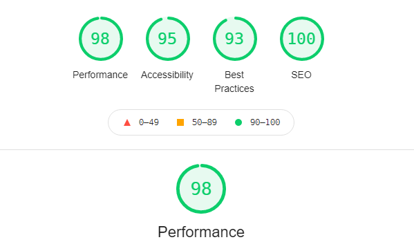
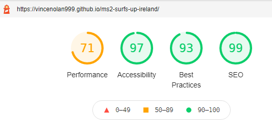

# Surfs Up Ireland

### [Link to Live Github hosted website](https://vincenolan999.github.io/ms2-surfs-up-ireland/)

## <u>Screenshots</u>

 

## A User-Centric Frontend Milestone Project

- This is my Second Milestone Project with Code Institute which introduces interactivity into the website by using Javascript.
The project I choose was an Interactive website of Surf locations along the Irish coast which has selectable locations from Google maps.
Also included in the site, a fully functioning Contact section for a user to send a comment/message. 

---
## <u>Table of Contents</u>
- [Screenshots](#screenshots)
- [UX](#ux)
    - [User goals](#user-goals)
    - [User stories](#user-stories)
    - [Structure of the website](#structure-of-the-website)
    - [Wireframes](#wireframes)
- [Features](#features)
- [Technology Used](#technology-used)
- [Testing](#testing)
    - [Functionality testing](#functionality-testing)
    - [Compatibility testing](#compatibility-testing)
    - [Code Validation](#code-validation)
    - [User stories testing](#user-stories-testing)
    - [Issues found during site development](#issues-found-during-site-development)
    - [Performance testing](#performance-testing)
- [Deployment](#deployment)
- [Credits](#credits)
 
 ---
## <u>UX</u>

 ### User Goals
  
 #### New user Goals

- Be able locate Surf locations in Ireland

- Ability to view Information and Images of the Surf spots.

- Have Links available for organization's in regards to surfing, including beach safety, water safety amongst others.

- A comment/message section that allows messages to be sent. The purpose expected to be recommendations for Surf locations, Information requests about surfing and 
  other surfing related companies wishing to collaborate

#### Returning User Goals

- Ability to see where popular surfing sites are, this could be either for planned trips or if they are in a location.  
  The partner Links also provide a one-stop-shop for beach and water safety information.

- Ability to leave comments on the areas visited.

### User Stories

#### As A New user.

- I want to locate Surfing locations in Ireland which I want to visit.

- I want to see Information on surf locations around Ireland
 
- I want to be able to send and leave comments, these may be for information request on locations or to leave reviews/ update on the locations.

- I want to have Links relevant to surfing present as this will save time in searching for them on the web.

#### As A returning user.

- I want to see what beaches are close to my location.

- I want to be able to leave suggestions for other locations and leave reviews on thous I have visited.

- I want to be able to see quicklinks to other surfing sites, this can be for safety, surfing conditions,  water safety etc.

#### Website Owner Goals

- To create a Surfing orientated website that has Interactive functionality that displays a map of Ireland and the ability to select locations.

- Each location to have unique information relating to the area.

- A message section that allows users to contact them if needed.

### Structure of the website

- I want the website to be easily accessible, simple to navigate and user friendly. It must also be displayed 
  for various devices (desktop ,Tablet, Mobile Phone) whilst maintaining a great user experience . Links within the website directing me to other Pages either within
  this website or to other social media accounts (Youtube etc). 

### Wireframes

- I used Balsamic to create wireframe mock ups of ho I envisioned the website to look.
These are listed below.

-  

---
## <u>Features</u>

- This website will consist of One main page of three sections. The sections will be a landing section with full page hero image of a surfer, the next section is the main content which features google maps that has selectable markers that then displays location images and information.  Finally the last section is a fully functioning contact section hosted by emailjs. 

#### Fonts

- The main font used is 'DM sans' with back-up of  sans-serif  obtained from [Google-fonts](www.fonts.google.com)

#### Images

- The main background images have all been obtained from [unsplash](www.unsplash.com) used for images as well. see [#credits](#credits)

- The images of the locations were obtained by google search and from Pinterest.  There were no obvious copyright restrictions.

#### Navbar and footer

- low profile navigation bar and footer with a color scheme that reflects the website.

- Navbar located at top with 'Brand' to the left and a responsive menu on the right. For Mobile and tablet this is 
  an expanding 'Hamburger' menu opening below the icon to reveal the three pages (Home, locations and Contact).

- Footer is located at the bottom and contains Social media links.

#### Hero Image

- Quality Image of a person surfing relevant to the website theme

#### Location and Map section

- Interactive googlemaps with custom markers. Zoom to function and scroll wheel enable for smooth transitions.   Selecting a marker on the map will change the display of the location section which has a short description of the beach, a relevant image and then useful information in regards to surfing.

#### Contact Page

-  Fully functioning contact form,  this could be for users to suggest other irish surf sites or to collaborate on other projects.

### Existing Features

- Smooth scrolling enabled from hamburger menu which makes for a cleaner visual experience. 

- Interactive map section that can change location information that is being displayed. 

- Fully functional contact section which uses focus to change background color to enable higher contrast in text input.  Contact section confirms success on sending a mail 
  and then resets the form. 

#### Future Features 

- Expansion of Surfing sites in ireland.

- Up-to date weather and 'swell' incorporated into the location display.

- Create a brand for other countries  (eg. Surfs Up Australia etc).

- Merchandise section relevant to surfing.

- storyboard/ comments board of reviews of the Surf locations.

[Back to Table of contents](#table-of-contents)

---
## <u>Technology Used</u>

* [HTML5](https://en.wikipedia.org/wiki/HTML5)
  - Main Programming language

* [CSS](https://en.wikipedia.org/wiki/CSS) 

  - Style sheet language

* [JS](https://www.javascript.com/)

  - Used to create interactive functionality

* [Google Fonts:](https://fonts.google.com/)

  - Used to import custom fonts

* [Font Awesome:](https://www.fontawesome.com) 

  - Used to import icons

* [GitHub:](https://www.github.com.com)

  - Used to store projects created in gitpod. 

* [Gitpod:](https://www.gitpod.io.com)

   - Used to develop the project, including version control (using commits and comments.)

* [Bootstrap 4:](https://www.getbootstrap.com)

  - Used to assist in a responsive site with a mobile first approach. 

* [Balsamic:](https://www.balsamiq.com)

   - Used to create wireframe of the project.

* [windows Photo editor](https://www.microsoft.com/en-us/p/photo-editor-for-windows-10/9mzwk7vt6b3g?activetab=pivot:overviewtab)

   - Basic photo editor

[Back to Table of contents](#table-of-contents)

---
## <u>Testing</u>

- Navbar
    - Clicking on the menu links takes you to the desired section.
    - Navbar brand link disabled
    - Hamburger menu appears at relevant view width and drop down menu works correctly

- Map and Location Section 

    - Googlemaps responsive, markers are shown and when pressed the information section including image is changed (all markers checked and correct)

- partner links

    - All 5 links tested and redirect to a new tab of the correct website
  
- Contact Page.
    
    - Each input box highlights light blues as intended  (helps with contrast)
    - Fill in field warning for input boxes present if left blank.
    - Fill in field with email address correctly displayed
    - Fill in field for textarea present.
    - Form completed with correct details to test receipt of message.
         - Send email button wording changes to 'sending'
         - Sent! alert box appears requiring a click on ok. (correct)
         - 'sending' button returns to 'send email'
         - Contact from is reset.
         - Emails is received from Emailjs, this confirms contact form working as intended.
         
- Footer 
    - Clicking the footer icons takes you to the correct website opened in a new tab.

### Functionality testing

- chrome Browser used to run Gitpod and developer tools used to test , solve problems, style and responsiveness.
Chrome developer tools used to check compatibility during project and to check on consistency.

- Mozilla Dev tools used to test in addition to chrome dev tools.    

- No issues detected.

### Compatibility testing

- I have tested the website on the virtual devices contained with the Dev Tools of Mozilla and Chrome with no 
issues seen on either. A wide range of screen sizes tested from mobile, tablet and desktop.

- I have tested compatibility on the github pages published website of the project on a 1920 x 1080 monitor, a galaxy s7 
and a Motorola  one+ mobile phone with no issues noted

- The website was submitted for peer review and no Issues were recorded by thous viewing.

### Code Validation
-  https://jigsaw.w3.org/css-validator/   

    - 2 errors found, however these were in the bootstrap cdn. This document validates as CSS level 3 + null 

-  https://validator.w3.org/

    - all pages checked with no issues. 

-  https://wave.webaim.org/ - A web accessibility checker

    - Errors present in the default JS code for googlemaps that i cannot change. No errors relating to my unique code.

    - contrast passed.

### User stories testing

- I want to locate Surfing locations in Ireland which I want to visit.
  - I can either press locations that scrolls to a section that has a googlemaps or scroll down manually. Displayed on the map are various markers along the 
    coast of Ireland.

- I want to see Information on surf locations around Ireland
  - There is a notice asking me to select a marker to display information.  Clicking on a marker zooms into this locations, a display section then changes
    to information relevant to the marker I selected. In the Display there is information about the beach including a photo. Below that there are Five information items,
    Beach rating, Surf school, Life Guard, Surf difficulty and Surf Break. 

- I want to be able to send and leave comments, these may be for information request on locations or to leave reviews/ update on the locations.
  - Either pressing 'contact' from the menu bar or scrolling to the bottom reveals a contact form where I can input my details and message. The input boxes change to a light
    blue so I can easily see the box I am typing in, A warning is also displayed if I leave if blank.  Upon sending a Mail I receive an onscreen prompt that tells me the message has been sent and the form is reset.

- I want to have Links relevant to surfing present as this will save time in searching for them on the web.
  - Below the Map section there are 5 Icons that link to other website. They all open in a separate tab on the website, there are links to :
     - environmental Protection agency which has details on bathing water quality
     - Water safety that offers best advice when in open waters.
     - Beaches.ie that has a comprehensive list of the beaches in Ireland
     - Irish surfing which is the official ireland surfing governing body.
     - Surf forecast where I can find out what the surfing conditions are.

### Returning User Stories Testing

- I want to see what beaches are close to my location.
  - I can quickly check the maps section in the website and can see the closest surf location from my location.

- I want to be able to leave suggestions for other locations and leave reviews on thous I have visited.
  - A contact section is present for me to message the website and leave any information in the form of a message.

- I want to be able to see quicklinks to other surfing sites, this can be for safety, surfing conditions,  water safety etc.
  - there are several links below the map section that has useful websites for Surfing.

### Issues found during development

-  Photos and Information not sizing correctly when the screen size changed. This has been corrected by custom Media query's for the common display breakpoints from small mobile devices to Personal computers.  I was unable to reset the form without causing other issues to present, finally advice from my mentor advised to call a function to reset the fields.

Whilst testing an error became apparent with screen width, and the parallax background stretch too far to the right.  Eventually located this issue in a media query font size for the partners icons.  Another presumed accidental code alteration occurred while attempting to increase the performance gains in lighthouse. This caused too many un necessary commits to be made and attempted rollbacks to previous shah number was needed and the issue was resolved. The issue being the marker selector no longer worked. This was not helped as I had API restriction on for the map only to be displayed via github pages and not in the Gitpod test browser. 

### Performance testing

  - I have used [Lighthouse](https://developers.google.com/web/tools/lighthouse/) for the performance testing.
     Initially showed performance drops due to Images being too large. 

- These were addressed and the results as follows.

#### Desktop performance

#### Mobile Performance

[Back to Table of contents](#table-of-contents)

---
## <u>Deployment</u>

My project was developed on Gitpod with regular commits during development to Github via pushing. This also ensured against data loss.

To deploy my project in github I took the following steps.

- Login and Select the repository in github. ([ms2-surfs-up-ireland](https://github.com/VinceNolan999/ms2-surfs-up-ireland))
- Click on the settings button
- locate the Github pages section.
- Select 'save' and then refresh or an auto refresh
- Displayed at top of Github pages - Your site is published at https://vincenolan999.github.io/ms2-surfs-up-ireland/

To Deploy locally.
- Login and Select the repository in github. [ms2-surfs-up-ireland](https://github.com/VinceNolan999/ms2-surfs-up-ireland)
- Go-to 'code' and  'download zip'
- Locate the ZIP file, unpack and deploy into your local environment.

Alternatively you can [Clone](https://docs.github.com/en/free-pro-team@latest/github/creating-cloning-and-archiving-repositories/cloning-a-repository)
or [Fork](https://docs.github.com/en/free-pro-team@latest/github/getting-started-with-github/fork-a-repo)
this repository ([ms2-surfs-up-ireland](https://github.com/VinceNolan999/ms2-surfs-up-ireland)) into your github account.

Googlemaps Deployment.
- To enable googlemaps on the website A unique API key will be required.  This is obtained from [Googlemaps Developers](https://developers.google.com/maps/documentation). Full documentation is provide within the developer website on how to create an account and relevant information on how to create a API key. A API key must be provided and relevant restrictions setup to prevent misuse.  
- Once the account is setup and navigated to the console, create a new project from the select project menu next to 'google cloud platform', name your project and create.
- In the dashboard select 'Go to API overview' and then at the top select 'enable apis and services'  Enable 'Maps Javascript API'
- In the credentials section select at the top '+ Create credentials' and then 'API KEY'
- This API key should be copied and paste into the project javascript code. This is Located at in the index.html file on:
 line 187 
- ensure the googlemaps documentation is fully read and understood and the advised restrictions are placed  to prevent misuse as you are required to enter billing details. This is fully explained in the tutorials.

[Back to Table of contents](#table-of-contents)

---
## <u>Credits</u>

### knowledge base and design ideas

* [getbootstrap.com/docs](https://getbootstrap.com)

* [w3schools.com](https://www.w3schools.com)

* [Googlemaps-Developers](https://developers.google.com/maps)

### Code Templates

- Navbar - [Bootstrap](https://getbootstrap.com/docs/4.6/components/navbar/)   

- [Smooth scrolling](https://webdesign.tutsplus.com/tutorials/smooth-scrolling-vanilla-javascript--cms-35165) 

- [emailjs](https://www.emailjs.com/)

### Content

- The Location descriptions were obtained from https://www.thebeachguide.co.uk.

### Media

- Location images obtained from google search on the locations which had no obvious restrictions.

- [Unsplash](https://www.unsplash.com) - background images 

  - Landing page  -  ben-selway-vWc2Xu_FkvQ-unsplash

  - Parallax Fore-ground image -  pat-whelen-a_yZlR4_IkQ-unsplash

  - Contact page  -  zachary-shea-MAFUZ8Nh7XQ-unsplash                                      

### Acknowledgments

- Mentor - ADEGBENGA ADEYE - Helped with final design and also provided advice on how to reset the contact form after submission.

- README adapted from My MS1 project

- Code Institute Pre-loaded github tools

- https://www.flaticon.com/free-icons/surfboard -  free favicon.

- https://fruitbatm.github.io/explore-national-parks-of-japan/ -  Credit due as the googlemaps interactive marker Java code fit in which my design ideas.
 
[Back to Table of contents](#table-of-contents)